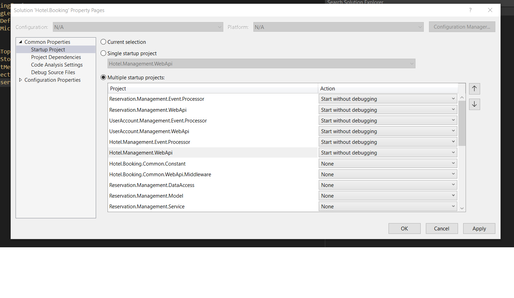

# Hotel Booking System
Picture an application similar to booking.com or makemytrip.com but at smaller scale that would allow hoteliers 
and customer to track reservations. System should fulfill several functional and non-functional requirements such as:
### Functional Requirements:
1. All reservations start at least the next day of booking
2. To give a chance to everyone to book the room, the stay can’t be longer than 3 days
and can’t be reserved more than 30 days in advance
3. Every end-user can check the room availability, place a reservation, cancel it or modify it
4. Hotel Managers should be able to onboard onto our platform
5. Hotel Managers should be able to update hotel properties for example, they might want to add a new room, or they might want to change the pricing, or they might want to add new images
6. From a customer standpoint, they should be able to search for a hotel in a particular location with a couple of search criteria. For example, they might want to filter within a price range or some aspects of the hotel like a five-star or a beach view or pool view, etc
### Non-Functional Requirements:
1. The quality of service must be 99.99 to 100% => no downtime
2. The booking application should be very consistent with high availability and high consistency
3. The application should be highly scalable

## Architecture Overview:
In order to fulfill all requirements it was designed an event driven arquitecture decoupled into several microservices so each of them can be scaled up on demand independently. By using load balancers in front of each of the App Servers that will host the rest web apis services, high availability should be guarantied. When traffic increases IT Departament can set up rules to scale up each of the App Services automatically and if this is not enough they can scale the app up by adding new App Server instances.   
System consist of 3 main microservices:
1. Hotel Management:
   - Meant to be mainly used by hotel manager users to create, update and delete  hotels, rooms and other info related to services, facilities as well.  
2. Reservation Management:
   - Can be considered as the heart of the system because it is the one in charge to provide all the services to allow searching hotels, room's availability and to manage reservations.
3. User Accounts Management
   - All the user's info and user profile's data is managed by this subsystem.

Each of these microservices is a rest webapi app built following a layered architecture pattern where at least you can detect 3 basic layers:
1. DataAccess
2. Services
3. Application

In order to communicate microservices between themselves and keeping data consistency in each of the microservice databases, a publish/subscriber messagging pattern was implemented by using Azure Service Bus as messaging broker system with topics where event messages are sent and Azure Functions acting as topic subscribers to process events. For image storage Azure Blob Storage was implemented.

## Webapi endpoints definitions per microservice:
In each microservice under: **/swagger/index.html** you can find all the available endpoints.

## Architecture High Level Diagram:

## Data Model Diagram:

## Tech Stack:
1. C# & .Net6
2. ASP.Net Core Web API
3. EntityFramework Core
4. OpenAPI/Swagger
5. NUnit, Mock
6. From Azure Cloud: 
   - Azure Service Bus
   - Azure Functions
   - Azure Blob Storage
   - Azure Sql DB
   - Azure Load Balancer & Azure App Server

## Running Locally:
1. You will need to create the 3 SQL DBs in your local server:
   - HotelManagement
   - ReservationManagement
   - UserAccountManagement   
   In each of these databases you will need to run all the migrations from command line by executing:

      `dotnet ef database update`   
    
2. In order to have a proper functionning all the webapi and azure function projects needs to be running at the same time, so you will need to update the solution by setting multiple startup projects.
       
   
   
3. Additionally it is a requirement to have an azure subscription account where you have azure service bus services up and running. Once you have your subscription account set you will need to update in the webapi projects the **appsettings.Development.json** file and in the azure functions projects the **local.settings.json** the app settings keys: **BlobStorageConnectionString**, **EventMessageConnectionString** and DB connection string in each microservice: **HotelManagement**, **ReservationManagement** or **UserAccountManagement**.
     
## Final observation:
1. WebApis are not secured at this moment, so in future at least one mechanism of security should be implemented (oauth, identity, azure key vault, etc)