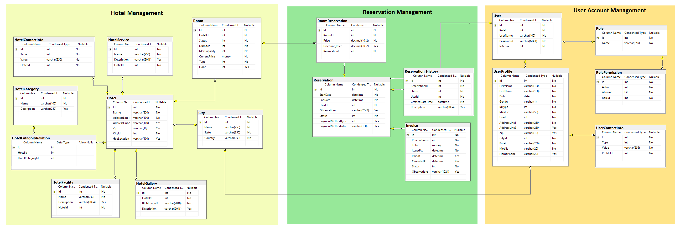

# Hotel Booking System
Picture an application similar to booking.com or makemytrip.com but at smaller scale that would allow hoteliers 
and customer to track reservations. System should fulfill several functional and non-functional requirements such as:
### Functional Requirements:
1. All reservations start at least the next day of booking
2. To give a chance to everyone to book the room, the stay can’t be longer than 3 days
and can’t be reserved more than 30 days in advance
3. Every end-user can check the room availability, place a reservation, cancel it or modify it
4. Hotel Managers should be able to onboard onto our platform
5. Hotel Managers should be able to update hotel properties for example, they might want to add a new room, or they might want to change the pricing, or they might want to add new images
6. From a customer standpoint, they should be able to search for a hotel in a particular location with a couple of search criteria. For example, they might want to filter within a price range or some aspects of the hotel like a five-star or a beach view or pool view, etc
### Non-Functional Requirements:
1. The quality of service must be 99.99 to 100% => no downtime
2. The booking application should be very consistent with high availability and high consistency
3. The application should be highly scalable

## Architecture Overview:
In order to fulfill all requirements it was designed an event driven arquitecture decoupled into several microservices so each of them can be scaled up on demand independently. By using load balancers in front of each of the App Servers that will host the rest web apis services, high availability should be guarantied. When traffic increases IT Departament can set up rules to scale up each of the App Services automatically and if this is not enough they can scale the app up by adding new App Server instances.   
System consist of 3 main Microservices:
1. Hotel Management
2. Reservation Management
3. User Accounts Management
## Architecture High Level Diagram:

## Data Model Diagram:
